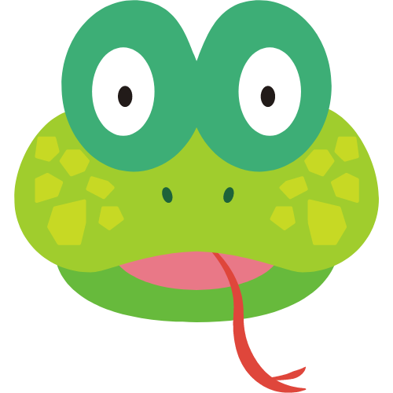

# Snake and Ladder Game

<p align="center">
  
  
  
</p>

Welcome to the Snake and Ladder Game implemented in Python using Tkinter! 🎲🐍

<p align="center">
  
</p>


<p align="center">
  
  
  
  
  
  
</p>

## Demo

<p align="center">
  <video width="600" controls>
    <source src="Demo Game.mp4" type="video/mp4">
    Your browser does not support the video tag.
  </video>
</p>

## How to Run

To run this game locally, follow these steps:

1. **Clone the repository:**
   ```bash
   git clone https://github.com/samriddha-basu-cloud/snake-and-ladder-game.git
   cd snake-and-ladder-game
   ```

2. **Create a virtual environment:**
   ```bash
   python3 -m venv .venv
   source .venv/bin/activate  # On Windows use `.venv\Scripts\activate`
   ```

3. **Install the requirements:**
   ```bash
   pip install -r requirements.txt
   ```

4. **Run the game:**
   ```bash
   python snake_and_ladder.py
   ```

## File Structure

```text
/Snake Ladder Game/
  ├─ .venv/
  │  ├─]bin/ (ignored)
  │  ├─]include/ (ignored)
  │  ├─]lib/ (ignored)
  │  ├─ .gitignore
  │  └─]pyvenv.cfg (ignored)
  ├─ build/
  │  ├─ Snake And Ladder Game/
  │  │  ├─ localpycs/
  │  │  │  ├─ pyimod01_archive.pyc
  │  │  │  ├─ pyimod02_importers.pyc
  │  │  │  ├─ pyimod03_ctypes.pyc
  │  │  │  └─ struct.pyc
  │  │  ├─ Analysis-00.toc
  │  │  ├─ base_library.zip
  │  │  ├─ EXE-00.toc
  │  │  ├─ PKG-00.toc
  │  │  ├─ PYZ-00.pyz
  │  │  ├─ PYZ-00.toc
  │  │  ├─ Snake And Ladder Game.pkg
  │  │  ├─ warn-Snake And Ladder Game.txt
  │  │  └─ xref-Snake And Ladder Game.html
  │  ├─ Snake\ And\ Ladder\ Game/
  │  │  ├─ localpycs/
  │  │  │  ├─ pyimod01_archive.pyc
  │  │  │  ├─ pyimod02_importers.pyc
  │  │  │  ├─ pyimod03_ctypes.pyc
  │  │  │  └─ struct.pyc
  │  │  ├─ Analysis-00.toc
  │  │  ├─ base_library.zip
  │  │  ├─ EXE-00.toc
  │  │  ├─ PKG-00.toc
  │  │  ├─ PYZ-00.pyz
  │  │  ├─ PYZ-00.toc
  │  │  ├─ Snake\ And\ Ladder\ Game.pkg
  │  │  ├─ warn-Snake\ And\ Ladder\ Game.txt
  │  │  └─ xref-Snake\ And\ Ladder\ Game.html
  │  └─ SnakeAndLadderGame/
  │     ├─ localpycs/
  │     │  ├─ pyimod01_archive.pyc
  │     │  ├─ pyimod02_importers.pyc
  │     │  ├─ pyimod03_ctypes.pyc
  │     │  └─ struct.pyc
  │     ├─ Analysis-00.toc
  │     ├─ base_library.zip
  │     ├─ EXE-00.toc
  │     ├─ PKG-00.toc
  │     ├─ PYZ-00.pyz
  │     ├─ PYZ-00.toc
  │     ├─ SnakeAndLadderGame.pkg
  │     ├─ warn-SnakeAndLadderGame.txt
  │     └─ xref-SnakeAndLadderGame.html
  ├─ dist/
  │  └─ SnakeAndLadderGame
  ├─ .DS_Store
  ├─ Demo Game.mov
  ├─ dice1.png
  ├─ dice2.png
  ├─ dice3.png
  ├─ dice4.png
  ├─ dice5.png
  ├─ dice6.png
  ├─ File Structure.txt
  ├─ requirements.txt
  ├─ snake_and_ladder.py
  ├─ snake.ico
  ├─ snake.png
  └─ SnakeAndLadderGame.spec
```

## Contributions

Contributions are welcome! If you'd like to improve this game or add new features, please fork the repository and submit a pull request.
